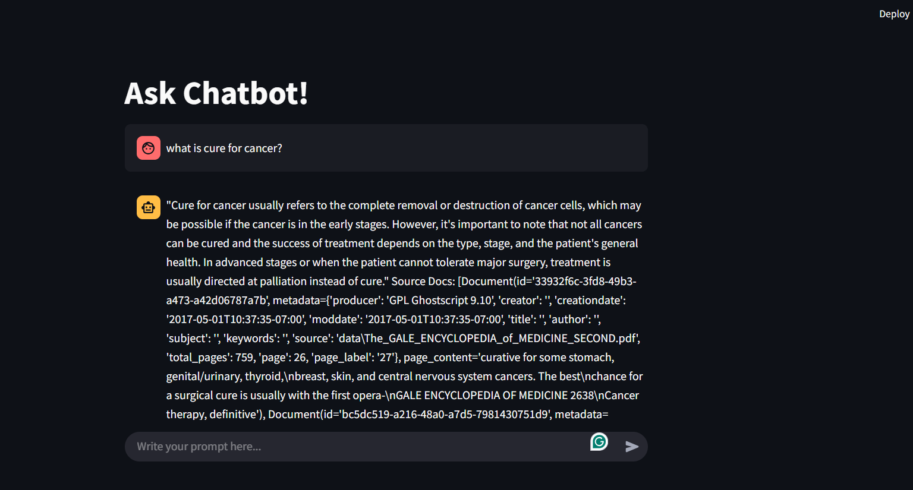

# 📌 Medical Chatbot with LangChain and Local LLM

> A medical chatbot that retrieves verified answers from a medical textbook using LangChain, FAISS, and a local Mistral model.

## Description

This project involves creating a medical chatbot that answers healthcare-related queries by retrieving content from a locally stored, pre-processed medical book.  

- **Why did you build it?** To offer an authentic, book-verified source for medical answers without relying on online APIs or paid LLM services.  
- **What problem does it solve?** Prevents misinformation by restricting answers to a credible, offline medical textbook, while providing transparent source references.  
- **Who is it for?** Medical students, healthcare professionals, and researchers looking for a trusted, offline, book-based Q&A tool.

## Features

- ✅ Retrieves answers strictly from a local medical book database  
- ✅ Displays accurate source metadata (page numbers and sections) with every response  
- ✅ Fast, offline responses with cached FAISS database  
- ✅ Uses a local Mistral model for LLM inference  
- ✅ Simple, clean Streamlit-based user interface  

## Tech Stack

- **Language(s):** Python  
- **Framework(s):** LangChain, Streamlit  
- **Tools/Libraries:** FAISS, Sentence Transformers, Mistral LLM  

## Installation

```bash
# Clone the repository
git clone https://github.com/zaarey/medical_chatbot_with_local_llm.git
```

## Usage

1. Load your medical textbook as a text document  
2. Split the text into fixed-size chunks  
3. Generate embeddings using Sentence Transformers  
4. Create and cache a FAISS vector database  
5. Connect FAISS with the local Mistral model using LangChain’s RetrievalQA chain  
6. Run the Streamlit app for user interaction  
7. Query the chatbot — get verified answers along with page numbers and section details  

## Contributing

Pull requests are welcome!  

 